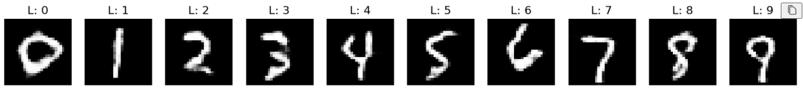

<H1>MNIST-cGAN: Adversarial Stability through Discriminator Regularization</H1>

This project implements a **Conditional GAN** (cGAN) optimized to resolve the vanishing gradient problem and achieve stable manifold learning on the MNIST dataset.

Technical Implementation:
* **Discriminator Regularization:** 40% Bernoulli Dropout to cap Discriminator confidence and preserve backpropagated gradient flow.
* **Batch Scaling:** Mini-batch size of **256** for high-throughput, low-variance gradient updates.
* **Loss:** Binary Cross Entropy with One-Sided Label Smoothing.

Architecture
* **Generator:** Transposed Convolutions + BatchNorm + ReLU.
* **Discriminator:** Convolutions + LeakyReLU (0.2) + 0.4 Dropout.
* **Conditioning:** Class Embedding concatenated to input noise and feature maps.

 

<i>Outputs for different input labels</i>

